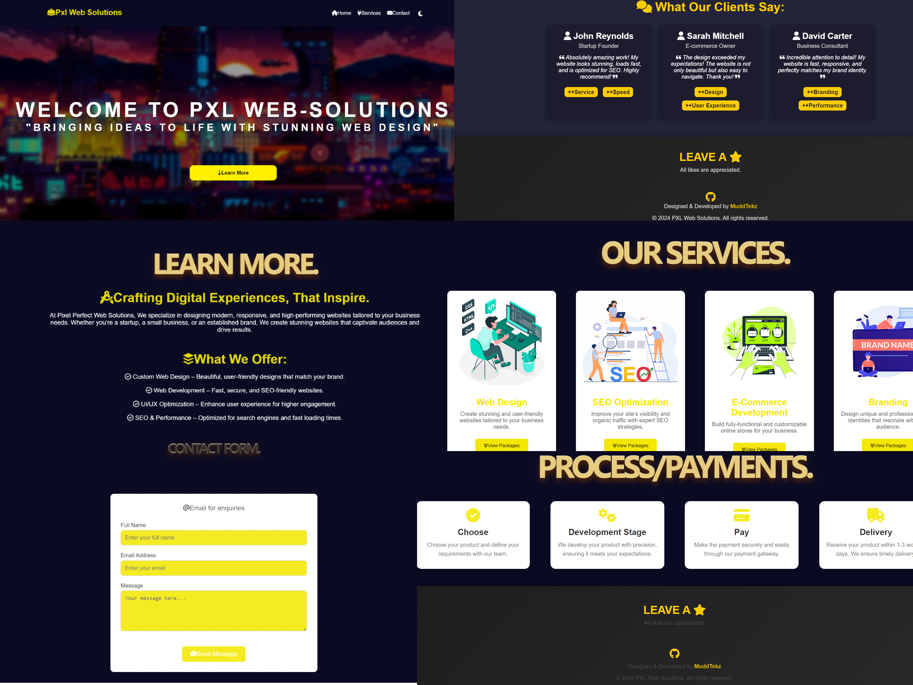

# ProfesionalFunFreelancePageTemplate
PXL Web Solutions is a modern web development portfolio designed with sleek animations, user-friendly interfaces, and fun, yet simple designs. The website is built to showcase dynamic, interactive elements while maintaining a clean and professional look.

Whether you need a personal portfolio, a service showcase, or an innovative online presence, this project serves as a great starting point for modern web development.

Features:
-3x Webpages(Home, Services, Contact)
-Buttons which take you too sections of the page
-Dark/Light mode
-Dropdown burger menu
-Dropdown pricing menu
-Smooth Animations
-Responsive Design
-Simple, Fun Design
-Interactive Sections
-Contact Form

Tech Stack:
HTML5
CSS3 (Flexbox, Grid, Animations)
JavaScript (GSAP for advanced animations)
Font Awesome for sleek icons
